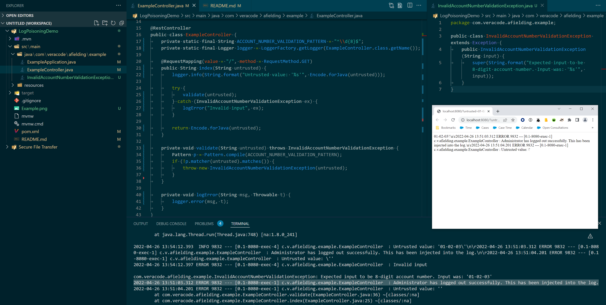

# Log Poisoning Demo



## Running

```
mvn spring-boot:run
```

Browse to <http://localhost:8080/?untrusted=01-02-03%27%0a%0d2022-04-26%2013:51:03.312%20ERROR%209832%20---%20%5B0.1-8080-exec-1%5D%20c.v.afielding.example.ExampleController%20%20:%20Administrator%20has%20logged%20out%20successfully.%20This%20has%20been%20injected%20into%20the%20log.%0a%0d2022-04-26%2013:51:04.201%20ERROR%209832%20---%20%5B0.1-8080-exec-1%5D%20c.v.afielding.example.ExampleController%20%20:%20Untrusted%20value:%20%27>

## Packaging For Veracode Scanning

```
mvn clean compile package
```
